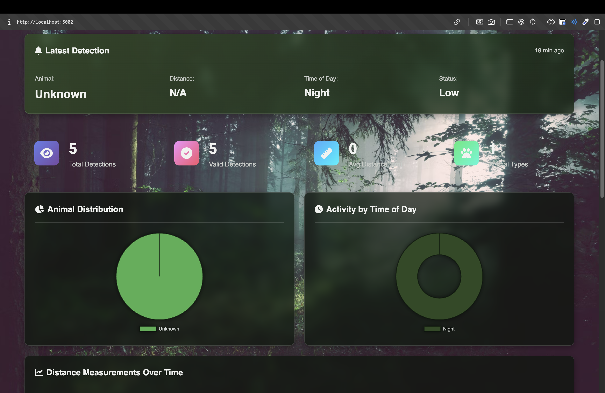

# 🌲 Smart Wildlife Monitoring System: Forest Watch

[](https://wokwi.com/projects/447393208559834113)

A sophisticated IoT solution for non-invasive wildlife tracking. This system uses an ESP32 and a suite of sensors to detect, identify, and monitor animal activity, sending real-time data to a sleek, interactive web dashboard.

---

## 🎥 Live Demo

https://github.com/lilswapnil/wildlife-monitoring/assets/168333395/2d83a333-2f89-45f5-981b-1d100222a0e9

---

## ✨ Core Features
- **Interactive Dashboard:** A sleek, dual-column interface showing live stats and an interactive sighting timeline.
- **Real-time Simulation:** Uses Wokwi to simulate a full hardware setup, allowing for testing without physical components.
- **15 Simulated Species:** Randomly detects and identifies a diverse range of forest animals.
- **Cloud Integration:** Seamlessly sends sensor data to ThingSpeak for logging and retrieval.
- **Intelligent Sensing:** Fuses data from PIR, Ultrasonic, and LDR sensors to make informed detections.
- **False Positive Rejection:** Smartly filters out irrelevant data to focus on genuine animal activity.

---

## 🛠️ Tech Stack & Hardware

| Category      | Technology / Component |
|---------------|------------------------|
| **Firmware**  | MicroPython on ESP32   |
| **Backend**   | Flask (Python)         |
| **Frontend**  | HTML, CSS, JavaScript  |
| **Charting**  | Chart.js               |
| **Cloud**     | ThingSpeak             |
| **Sensors**   | PIR, Ultrasonic, LDR   |
| **Simulation**| Wokwi                  |

---

## 🚀 Getting Started

This project is designed to be run entirely through simulation. No physical hardware is required.

### 1. Open in Wokwi
Click the link below to open the pre-configured simulation environment. The ESP32, sensors, and wiring are all set up.

**[▶️ Simulate the Project on Wokwi](https://wokwi.com/projects/447393208559834113)**

<p align="center">
  
</p>

### 2. Run the Local Web Dashboard

**Clone the repository:**
```bash
git clone https://github.com/lilswapnil/wildlife-monitoring.git
cd wildlife-monitoring
```

**Set up the environment:**
```bash
# Create and activate a virtual environment
python3 -m venv venv
source venv/bin/activate

# Install dependencies
pip install -r requirements.txt
```

**Configure ThingSpeak Credentials:**
Create a `credentials.py` file from the example and add your ThingSpeak Channel ID and Read API Key.
```bash
cp credentials.py.example credentials.py
```
*You can find your keys under the "API Keys" tab in your ThingSpeak channel.*

**Run the server:**
```bash
./run.sh
```
Now, open your browser to **`http://localhost:5001`** to see the live dashboard.

### 3. Start the Simulation
Go back to your Wokwi browser tab and press the "play" button. Interact with the simulated sensors (click the PIR, drag the ultrasonic slider) and watch the data appear on your local dashboard in real-time!

---

## ⚙️ ThingSpeak Channel Configuration
For the dashboard to work correctly, your ThingSpeak channel must have **5 fields enabled**.

1.  Go to your channel's **"Channel Settings"** tab.
2.  Enable and name the fields as follows:
    - `Field 1`: `motion`
    - `Field 2`: `distance_cm`
    - `Field 3`: `light_level`
    - `Field 4`: `false_positive`
    - `Field 5`: `animal_id`
3.  Click **"Save Channel"**.

---

## 📂 Project Structure
```
wildlife-monitoring/
│
├── main.py              # ESP32 firmware (MicroPython)
├── app.py               # Flask web application backend
│
├── templates/
│   └── index.html       # Dashboard HTML structure
│
├── static/
│   ├── css/style.css    # Dashboard styling
│   └── js/app.js        # Frontend logic and interactivity
│
├── assets/
│   ├── demo.mov         # Project demo video
│   └── wokwi-setup.png  # Wokwi setup image
│
├── credentials.py.example # Example for credentials
├── requirements.txt     # Python dependencies
└── README.md            # This file
```

---

## 📜 License
This project is licensed under the **MIT License**. See the [LICENSE](LICENSE) file for details.
