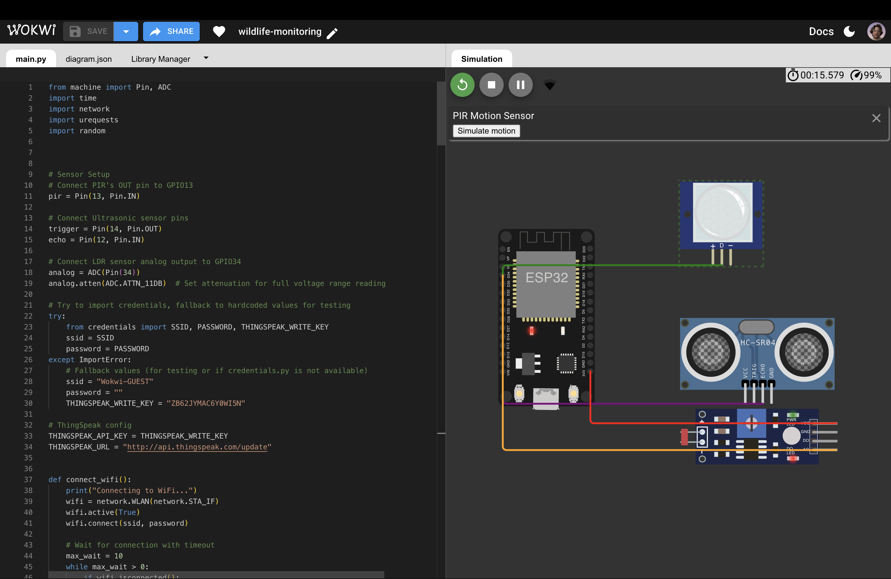
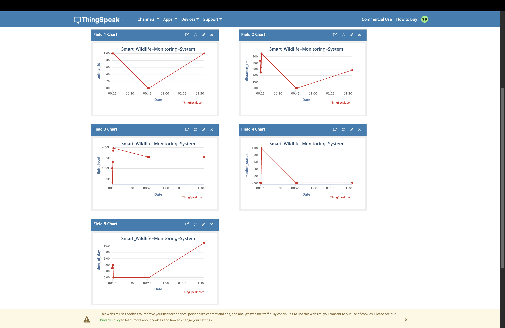
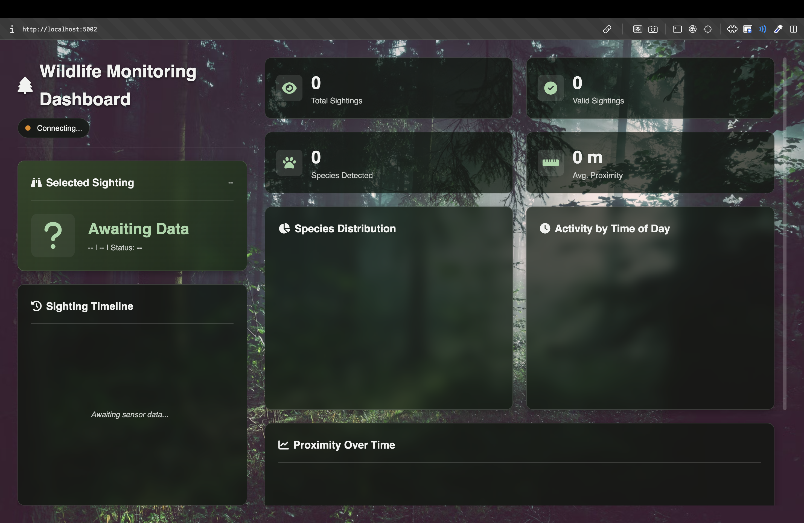

# 🌲 IoT Wildlife Monitoring System: Forest Watch

[](https://wokwi.com/projects/447393208559834113)
[](LICENSE)

---

## 🎥 Project Demo

<p align="center">
   <video controls playsinline loop muted poster="assets/dashboard-result.png" style="max-width:100%;width:700px;height:auto;">
      <source src="assets/demo.mp4" type="video/mp4">
      <source src="assets/demo.mov" type="video/quicktime">
      Your browser does not support embedded video. Download or view the demo: <a href="assets/demo.mov">Demo video</a>.
   </video>
</p>

A comprehensive IoT wildlife monitoring system built with a Python FastAPI backend and simulated in Wokwi. The system uses ThingSpeak for data aggregation and features a backend-heavy architecture with local data persistence, real-time processing, and a modern interactive dashboard for tracking 15 different animal species.

---


*The Forest Watch dashboard displaying real-time wildlife detection data with interactive timeline and analytics.*

---

## ✨ Key Features

### 🔧 Backend Architecture
- **Backend-Heavy Design:** SQLite database for efficient local data persistence and caching
- **Smart Data Sync:** Intelligent synchronization with ThingSpeak, fetching only new entries
- **RESTful API:** Single consolidated endpoint serving all dashboard data
- **Modular Codebase:** Clean separation between database, utilities, and application logic

### 🦊 Wildlife Detection
- **15 Animal Species:** Fox, Badger, Deer, Squirrel, Rabbit, Hedgehog, Owl, Woodpecker, Boar, Bear, Raccoon, Skunk, Lynx, Wolf, Moose
- **Intelligent Identification:** Time-of-day aware animal detection (nocturnal, diurnal, crepuscular)
- **Multi-Sensor Fusion:** Combines PIR motion, ultrasonic distance, and LDR light sensors
- **False Positive Filtering:** Advanced logic to reduce invalid detections

### 📊 Dashboard & Visualization
- **Real-Time Updates:** Auto-refreshing dashboard with live data
- **Interactive Timeline:** Click on any sighting to view detailed information
- **Rich Analytics:** Animal distribution, time-of-day patterns, proximity tracking
- **Modern UI:** Forest-themed design with responsive layout

---

## 🛠️ Technology Stack

| Layer          | Technology                          |
|----------------|-------------------------------------|
| **Hardware**   | ESP32 (Wokwi Simulation)           |
| **Firmware**   | MicroPython                         |
| **Sensors**    | PIR Motion, HC-SR04 Ultrasonic, LDR |
| **Backend**    | Python, FastAPI, SQLite             |
| **Cloud**      | ThingSpeak IoT Platform             |
| **Frontend**   | HTML5, CSS3, Vanilla JavaScript     |
| **Charting**   | Chart.js                            |
| **Libraries**  | python-dotenv, requests, pytz       |

---

## 📂 Project Structure

The project follows a professional, modular architecture with clear separation of concerns:

```
wildlife-monitoring/
│
├── 📄 app.py                    # Main FastAPI application entry point
├── 📄 requirements.txt          # Python dependencies
├── 📄 wokwi.toml               # Wokwi simulator configuration
├── 📄 diagram.json             # Wokwi circuit diagram
├── 📄 .env                     # Environment variables (YOUR CREDENTIALS)
├── 📄 .env.example             # Template for environment variables
├── 📄 .gitignore
├── 📄 LICENSE
├── 📄 README.md
│
├── 📁 backend/                 # Backend logic and data layer
│   ├── database.py             # SQLite database operations
│   └── utils.py                # ThingSpeak API & data processing
│
├── 📁 firmware/                # ESP32 device code
│   ├── main.py                 # MicroPython entry point
│   ├── config.py               # Hardware configuration & constants
│   ├── credentials.py          # WiFi & ThingSpeak keys (device-side)
│   └── credentials.py.example  # Template for device credentials
│
├── 📁 static/                  # Frontend assets
│   ├── css/
│   │   └── style.css           # Dashboard styling
│   └── js/
│       └── app.js              # Frontend logic and API calls
│
├── 📁 templates/               # HTML templates
│   └── index.html              # Main dashboard page
│
└── 📁 assets/                  # Documentation media
    ├── dashboard-result.png    # Dashboard screenshot
    ├── dashboard-init.png      # Initial dashboard view
    ├── wokwi.png              # Wokwi simulator screenshot
    ├── diagram.png            # Circuit diagram
    ├── ThingSpeak.png         # ThingSpeak configuration
    └── demo.mov               # Video demonstration
```

### 📋 Key File Descriptions

**Backend Layer:**
- `app.py` - FastAPI application with routing and API endpoints
- `backend/database.py` - Handles SQLite database initialization, sync, and queries
- `backend/utils.py` - ThingSpeak API client and data processing functions

**Firmware Layer:**
- `firmware/main.py` - Main ESP32 firmware with sensor reading and animal identification
- `firmware/config.py` - Centralized configuration for pins, thresholds, and animal characteristics

**Frontend Layer:**
- `templates/index.html` - Dashboard HTML structure
- `static/css/style.css` - Forest-themed responsive design
- `static/js/app.js` - Dashboard interactivity, API calls, and Chart.js integration

---

## 🏗️ System Architecture

```
┌─────────────────┐
│  ESP32 (Wokwi)  │  ← Simulated Hardware
│  Sensors: PIR,  │
│  Ultrasonic,LDR │
└────────┬────────┘
         │ WiFi
         ↓
┌─────────────────┐
│   ThingSpeak    │  ← Cloud IoT Platform
│   Channel       │     (Data Logging)
└────────┬────────┘
         │ REST API
         ↓
┌─────────────────┐
│ FastAPI Backend │  ← Smart Sync Layer
│  SQLite DB      │     (Local Cache)
└────────┬────────┘
         │ JSON API
         ↓
┌─────────────────┐
│  Web Dashboard  │  ← User Interface
│  (Browser)      │     (Visualization)
└─────────────────┘
```

**Data Flow:**
1. ESP32 reads sensor data and identifies wildlife
2. Data is sent to ThingSpeak via HTTP POST
3. Flask backend periodically syncs new data to local SQLite database
4. Dashboard fetches data from backend's `/api/dashboard` endpoint
5. Charts and timeline are updated in real-time

---

## 🚀 Getting Started

### Prerequisites

- Python 3.8 or higher
- A modern web browser (Chrome, Firefox, Safari, Edge)
- A free [Wokwi](https://wokwi.com/) account
- A free [ThingSpeak](https://thingspeak.com/) account

---

### Step 1: Set Up Wokwi Simulation

The hardware simulation runs entirely in your browser using Wokwi.

1. **Open the Project in Wokwi:**
   
   Click here: **[▶️ Launch Wokwi Simulator](https://wokwi.com/projects/447393208559834113)**

2. **Configure Device Credentials:**
   
   In the Wokwi file explorer, create a new file `credentials.py` in the firmware folder with:
   ```python
   SSID = "Wokwi-GUEST"
   PASSWORD = ""
   THINGSPEAK_WRITE_KEY = "YOUR_WRITE_API_KEY"
   ```

3. **Start the Simulation:**
   
   Press the green **Play** button. The ESP32 will:
   - Connect to WiFi
   - Read sensor data
   - Send detections to ThingSpeak every 15 seconds

<p align="center">
  
</p>

---

### Step 2: Configure ThingSpeak Channel

1. **Create a New Channel** on [ThingSpeak](https://thingspeak.com/)

2. **Enable 5 Fields** with these exact names:
   - `Field 1`: **Motion**
   - `Field 2`: **Distance**
   - `Field 3`: **Light Level**
   - `Field 4`: **False Positive**
   - `Field 5`: **Animal ID**

3. **Save Channel Settings**

4. **Get Your API Keys:**
   - Go to the **"API Keys"** tab
   - Note your **Channel ID** and **Read API Key**

<p align="center">
  
</p>

---

### Step 3: Set Up Local Backend

1. **Clone the Repository:**
   ```bash
   git clone https://github.com/lilswapnil/wildlife-monitoring.git
   cd wildlife-monitoring
   ```

2. **Create a Virtual Environment:**
   ```bash
   python3 -m venv venv
   source venv/bin/activate  # macOS/Linux
   # venv\Scripts\activate   # Windows
   ```

3. **Install Dependencies:**
   ```bash
   pip install -r requirements.txt
   ```

4. **Configure Environment Variables:**
   
   Create a `.env` file in the project root:
   ```bash
   cp .env.example .env
   ```
   
   Edit `.env` and add your ThingSpeak credentials:
   ```
   THINGSPEAK_CHANNEL_ID="YOUR_CHANNEL_ID"
   THINGSPEAK_READ_KEY="YOUR_READ_API_KEY"
   ```

5. **Run the Application:**
   ```bash
   python3 app.py
   ```

6. **Open the Dashboard:**
   
   Navigate to **http://localhost:5009** in your browser

<p align="center">
  
</p>

---

## 🎮 Usage

1. **Start the Wokwi simulation** - The ESP32 will begin detecting and sending data
2. **Open the dashboard** in your browser
3. **Click on any timeline item** to view detailed sighting information
4. **Watch the charts update** as new data arrives from ThingSpeak

The backend automatically syncs new data every time you refresh the dashboard, storing it locally for fast retrieval.

---

## 📊 Dashboard Features

- **Statistics Cards:** Total detections, valid sightings, average distance, species count
- **Animal Distribution:** Pie chart showing detected species
- **Time of Day Analysis:** When animals are most active
- **Proximity Timeline:** Line chart tracking distance over time
- **Interactive Timeline:** Click any detection to see full details
- **Live Status Indicator:** Connection status with ThingSpeak

---

## 🔧 Configuration

### Backend Configuration (`.env`)
```
THINGSPEAK_CHANNEL_ID="YOUR_CHANNEL_ID"
THINGSPEAK_READ_KEY="YOUR_READ_API_KEY"
PORT=5009  # Optional: Change server port
```

### Firmware Configuration (`firmware/config.py`)
- Sensor pin mappings
- Detection thresholds
- Simulation parameters
- Animal characteristics and activity patterns

---

## 🤝 Contributing

Contributions are welcome! Please feel free to submit a Pull Request.

1. Fork the repository
2. Create your feature branch (`git checkout -b feature/AmazingFeature`)
3. Commit your changes (`git commit -m 'Add some AmazingFeature'`)
4. Push to the branch (`git push origin feature/AmazingFeature`)
5. Open a Pull Request

---

## 📜 License

This project is licensed under the **MIT License**. See the [LICENSE](LICENSE) file for details.

---

## 🙏 Acknowledgments

- **Wokwi** for providing an excellent IoT simulation platform
- **ThingSpeak** for cloud IoT data logging
- **Chart.js** for beautiful data visualization
- The open-source community for continuous inspiration

---

## 📧 Contact

**Swapnil** - [@lilswapnil](https://github.com/lilswapnil)

Project Link: [https://github.com/lilswapnil/wildlife-monitoring](https://github.com/lilswapnil/wildlife-monitoring)

---

<p align="center">Made with ❤️ for wildlife conservation</p>
